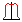
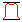
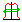

.. index:: Image; Pane

The Image Pane
==============

The image pane displays the image, 2D array values, dose or fluence map. The image pane can be maximised in the application window by clicking the maximise button |max|. The image can be windowed using the slider on the right hand side of the image. The image pane can be returned to its original state by clicking the minimise button |min|. You can quickly move the profiles to an appropriate point on the image by clicking on this point with the mouse.

The image pane contains a tool bar with buttons that allow various operations can be carried out on the image. The File Open |open|, Print |print| and Exit |exit| buttons are shortcuts to the equivalent menu bar functions. Other functions available are:

*  |invert| :ref:`Invert`
*  |norm| :ref:`Normalise to CAX`
*  |normmax| :ref:`Normalise to MAX`
*  |centre| :ref:`Centre Field`

.. toctree::
   :maxdepth: 1
   :hidden:
   
   BSHelp8-2-1.rst
   BSHelp8-2-2.rst
   BSHelp8-2-3.rst
   BSHelp8-2-4.rst

